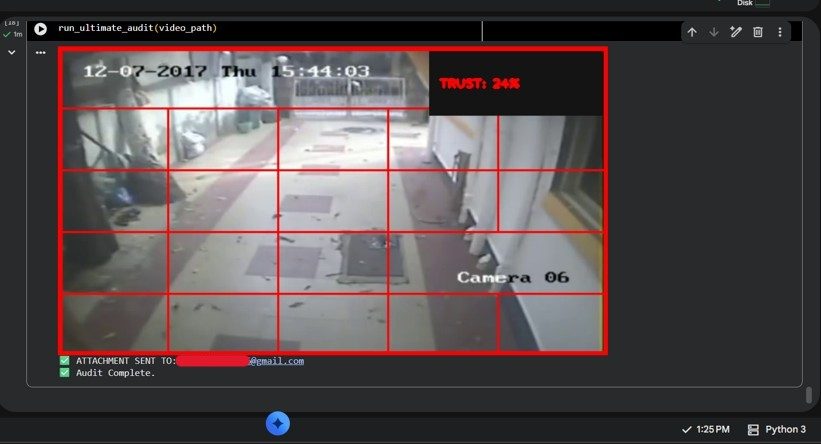
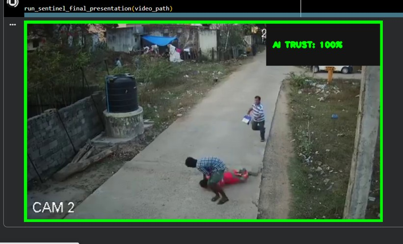
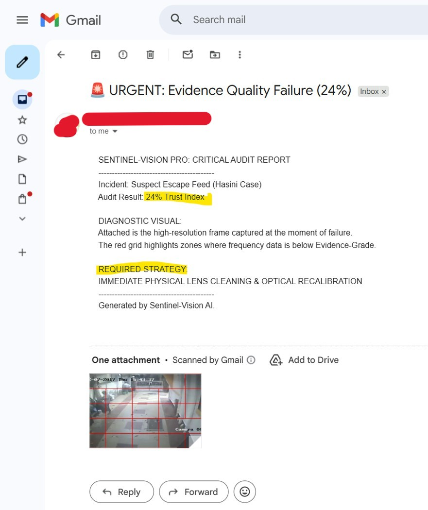
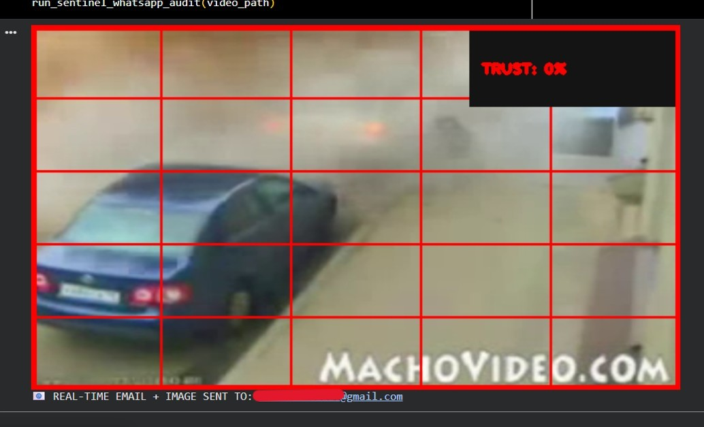

# 🚨 Sentinel-Vision Pro

## 🧠 Overview
Sentinel-Vision Pro is an AI-based system that monitors CCTV footage quality in real-time and detects issues like blur, low lighting, and noise.  
It ensures reliable surveillance by triggering instant alerts via Email and Telegram when camera quality drops.

---

## 🏆 Achievement
🥇 1st Place – Think AI Hackathon   
🏫 M.S. Ramaiah Institute of Technology  

---

## 🚀 Features
- Real-time frame quality analysis  
- Blur detection using Laplacian method  
- Low-light detection using brightness threshold  
- Noise detection  
- Email alert system  
- Telegram bot notifications  
- AI Trust Score for frame reliability  

---

## 🛠️ Tech Stack
- Python  
- OpenCV  
- NumPy  
- SMTP (Email Alerts)  
- Telegram Bot API  

---

## ⚙️ Algorithm / Working
- Convert frame to grayscale  
- Compute Laplacian variance → detect blur  
- Calculate brightness → detect low light  
- Apply threshold conditions  
- Generate AI Trust Score  
- Trigger alerts via Email & Telegram if quality drops  

---

## 📦 Requirements
- opencv-python
- numpy
- imageio

  
---

## 📂 Project Structure
zeta-black-alert-system/
│
├── main.py
├── requirements.txt
├── dataset/
├── outputs/
└── README.md

---

## ▶️ How to Run
pip install -r requirements.txt
python main.py

---

## 📸 Results

  
  
  
  
   

---

## ⚠️ Note
Do not upload personal email credentials or API keys.  
Configure them locally before running the project.

---

## 👤 Author
ZetaBlack
